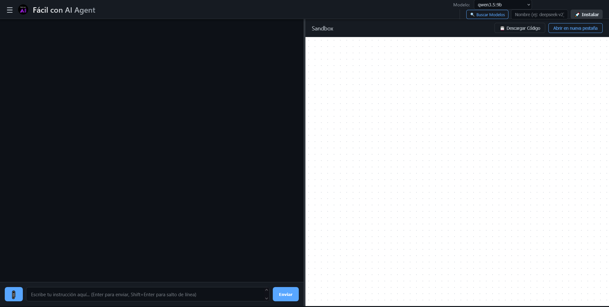

# 🤖 Fácil con AI Agent — macOS

Una interfaz web local para usar modelos de inteligencia artificial directamente desde tu navegador, sin suscripciones ni datos en la nube. Powered by [Ollama](https://ollama.com).



> 🪟 ¿Usas Windows? El repositorio para Windows está disponible por separado.

---

## 🎬 Video tutorial

Antes de empezar, mira el tutorial completo en YouTube donde explico paso a paso cómo instalar y usar la app:

[](https://www.youtube.com/watch?v=nXyvUzSy0BI)

---

## ✨ ¿Qué hace esta app?

- 💬 **Chat con IA local** — Conversa con cualquier modelo de Ollama (Llama, Mistral, DeepSeek, Gemma, etc.)
- 🖥️ **Sandbox en vivo** — El código que genera la IA se renderiza al instante en el panel derecho
- 📦 **Instala modelos desde la app** — Sin usar la Terminal, solo escribe el nombre y dale a instalar
- 💾 **Historial de sesiones** — Guarda tus conversaciones en el navegador
- 📎 **Adjunta archivos** — Sube imágenes o archivos de texto como contexto para la IA
- 🔒 **100% privado** — Todo corre en tu máquina. Ningún dato sale a internet

---

## 🖥️ Requisitos

- Mac con macOS 12 Monterey o superior
- Ollama (el lanzador lo instala automáticamente si no lo tienes)
- Un navegador moderno (Chrome, Firefox, Safari)
- Conexión a internet **solo** para descargar modelos por primera vez

---

## 🚀 Instalación y uso

1. Descarga o clona este repositorio

2. Abre la **Terminal** y ejecuta este comando **una sola vez** para dar permisos al lanzador:
   ```bash
   chmod +x /ruta/a/la/carpeta/Facil_con_AI_Agent_Run.command
   ```
   > 💡 Truco: Arrastra el archivo `.command` a la Terminal y el sistema escribe la ruta solo.

3. Haz doble clic en **`Facil_con_AI_Agent_Run.command`** desde el Finder

4. Si macOS muestra un aviso de seguridad la primera vez:
   - Ve a **Ajustes del Sistema → Privacidad y Seguridad**
   - Busca el mensaje sobre el archivo bloqueado y haz clic en **"Abrir de todas formas"**

5. ¡Listo! La app se abre automáticamente en tu navegador

---

## 📥 Cómo descargar modelos de IA

Una vez abierta la app, en la barra superior encontrarás el **Instalador de Inteligencias**:

1. Haz clic en **🔍 Buscar Modelos** para explorar el catálogo de Ollama
2. Copia el nombre del modelo que quieras (ej: `llama3`, `mistral`, `deepseek-r1`)
3. Pégalo en el campo de texto del instalador
4. Haz clic en **🚀 Instalar** y espera (puede tardar según el tamaño del modelo y tu conexión)

> ⚠️ Algunos modelos pesan varios GB. Asegúrate de tener espacio en disco.

---

## 📁 Estructura del proyecto

```
facil-con-ai-agent-mac/
├── index.html                          # Interfaz principal
├── style.css                           # Estilos visuales (tema oscuro)
├── script.js                           # Lógica de la app y conexión con Ollama
├── Facil_con_AI_Agent_Run.command      # Lanzador (doble clic desde Finder)
├── Facil_con_AI_Agent_Run.sh           # Lanzador alternativo desde Terminal
├── screenshot.png                      # Vista previa
└── logo.png                            # Logo de la app
```

---

## 🔧 Solución de problemas

**"Ollama inactivo o sin conexión" en el selector de modelos**
- Asegúrate de haber ejecutado el lanzador `.command` y no haber abierto el `index.html` manualmente
- Verifica que Ollama esté corriendo: abre una Terminal y escribe `ollama list`

**Error de CORS**
- No abras el `index.html` directamente desde el Finder; usa siempre el lanzador, que configura los permisos necesarios

**"No se puede abrir porque es de un desarrollador no identificado"**
- Ve a **Ajustes del Sistema → Privacidad y Seguridad → Abrir de todas formas**

**El modelo tarda mucho en responder**
- Es normal en la primera respuesta (el modelo se carga en RAM)
- Modelos más pequeños como `mistral` o `llama3.2:1b` son más rápidos en equipos con poca RAM

---

## 🤝 Contribuciones

¡Las contribuciones son bienvenidas! Si encuentras un bug o tienes una idea:

1. Abre un **Issue** describiendo el problema o la mejora
2. Haz un **Fork** del repositorio
3. Crea una rama con tu cambio: `git checkout -b mi-mejora`
4. Haz un **Pull Request**

---

## 📄 Licencia

MIT — Úsalo, modifícalo y distribúyelo libremente.

---

Hecho con ❤️ para que cualquier persona pueda usar IA local sin complicaciones.
